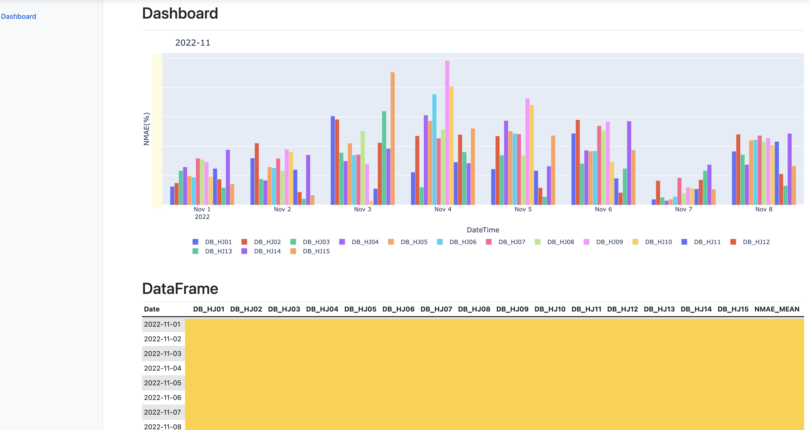
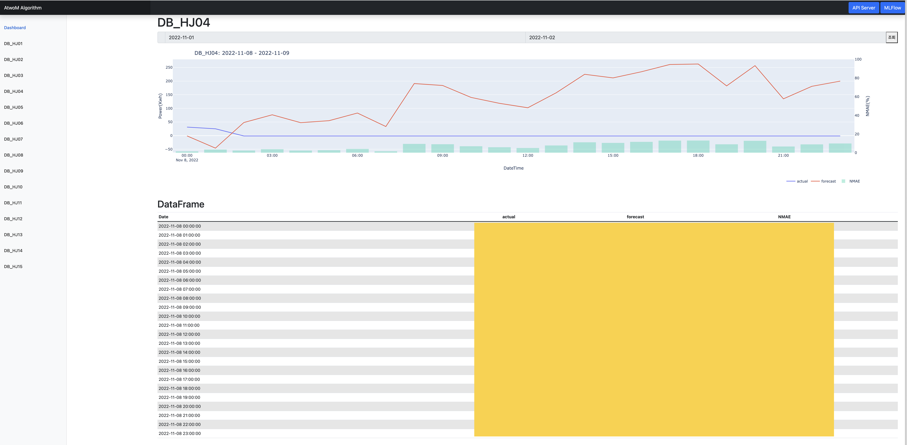

# Example Viewer
**샘플데이터는 제공하지 않습니다.** 
**기본 파이썬 가상환경은 아나콘다 혹은 미니콘다로 구성하는것을 추천(pip로 오류걸리는 라이브러리들이 간혹 있음)**
------
## 0. 만든 이유
코드 입력 필요 없이 쉽게 웹 상으로 예측 데이터와 본 데이터의 오차율 비교와 그래프를 보기 위해서

## 1. 시스템 요구사항
###  python: 3.7 or upper
- pandas
- numpy
- SQLAlchemy 1.4.42
- psycopg2 -> conda 설치 추천
- hyperopt
- plotly

### Database
- postgresql

## 2. 샘플
### DashBoard Sample

### Generator Sample
